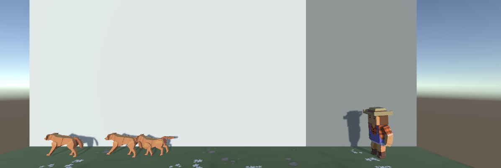

# 🐶🎾 Unity Challenge – Catch the Falling Ball

In this Unity mini challenge, you're controlling an adorable dog that tries to catch randomly falling balls from the sky! When the player presses the **Spacebar**, the dog spawns and runs to catch the ball. But watch out — if the ball hits the ground, it’s game over!

---

## 📸 Screenshots

### 🛠️ Scene View:

---

## 🎯 Challenge Overview

This project is designed to reinforce core Unity C# skills such as **arrays** and **random number generation**.  
The goal is to time your dog’s spawn just right to catch the falling balls.

---

## 🧩 Challenge Outcome

### 🧠 Game Behavior:
- 🎲 One of three ball prefabs is **randomly selected**
- 📍 The ball is spawned at a **random X position** at the top of the screen
- ⌨️ When the player presses the **Spacebar**, a dog spawns
- 🐶 The dog runs toward the ball
- 💥 If the dog collides with the ball: **the ball is destroyed**
- ⛔ If the ball hits the ground: a **"Game Over"** debug message is displayed
- 🧹 Any off-screen dogs or balls are removed from the scene

---

## 🛠️ Features Used

| Feature                     | Description |
|-----------------------------|-------------|
| **Arrays**                  | Used to store the ball prefabs |
| **Random.Range()**          | Used to pick a random prefab and spawn position |
| **Instantiate()**           | To create ball and dog objects in the scene |
| **Destroy()**               | To remove objects from the scene |
| **Input.GetKeyDown(KeyCode.Space)** | Detects Spacebar press |
| **OnTriggerEnter**          | Detects collisions between dog and ball |
| **if / else-if statements** | Used for game logic and conditions |
| **Debug.Log()**             | Displays the "Game Over" message |

---

## 🗂️ Project Folder Structure
